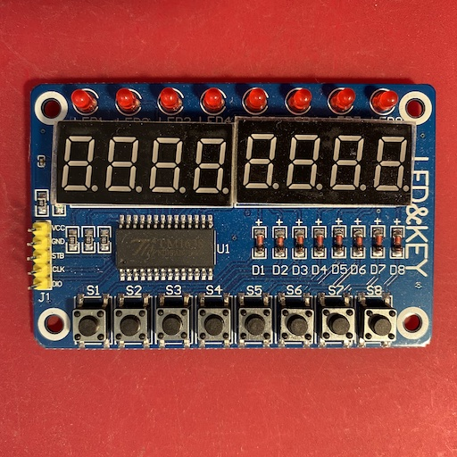
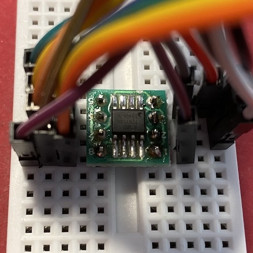

### UART Debug Console
Это проект переходника для использования платы LED&KEY в качестве отладочной консоли, подключаемой по UART.

Плата выглядит так:

Как видно, она содержит восемь семисегментных индикаторов, восемь светодиодов и восемь тактовых кнопок. Идея заключается в том, чтобы по UART простыми короткими командами управлять светодиодами и печатать строку чисел на индикаторах, а при нажатии и отпускании кнопок отправлять соответствующие этим событиям сообщения обратно в UART. Такое бесхитростное устройство позволит пообщаться с другим подобным устройством на МК без привлечения ПК: отдать до восьми команд и получить какой-никакой, понятный человеку ответ.

Переходник выполнен на микроконтроллере **ATtiny13A**. Просто потому что он относительно дешёвый, простой в программировании, и его ресурсов достаточно для решения поставленной задачи. МК был в корпусе SOIC-8, поэтому, для удобства прототипирования на макетной плате, он был распаян на переходник SOIC8-to-DIP.

Образец некачественной пайки

Выводы МК припаялись легко, припой растекался идеально, а запах канифоли пробуждал древние детские воспоминания. А вот штырьки в отверстиях не поддавались никак: сколько ни грей и сколько канифоли ни добавляй, припой катается шариком и не прилипает, только жало обуглилось и токопроводящие дорожки отклеились. Может быть, я что-то не понимаю, но, по-моему, такого быть не должно. В итоге помог более сильный флюс, но осадочек и изуродованные дорожки остались.

МК имеет шесть GPIO, и все они находятся на одном порте B, поэтому, имя порта захардкожено, и исходник не имеет права называться универсальным. Три произвольных пина подключаются к плате и два других произвольных используются в качестве tx/rx. Номера использованных пинов указываются в соответстующих константах перед компилированием.

Внезапно выяснилось, что именно эта модель не содержит аппаратного UART, поэтому, его пришлось реализовывать программно ценой почти половины от 1KB памяти программ. А 64 байта ОЗУ должно хватить всем. Параметры UART тоже захардкожены как 9600 бод без бита чётности и одним стоп-битом.

Скрипты сборки и загрузки рассчитаны на `macOS` \(возможно, будут работать на другой UNIX-like ОС), `avr-gcc`, `avr-binutils`, `avrdude` \(они должны быть установлены в системе) и программатор [USBasp](https://www.fischl.de/usbasp/).

Протокол обмена по UART следующий.

- `C` - очистка индикаторов и светодиодов;
- `P([0-9\s].?){,8}` - вывод строки чисел с пробелами и опциональной точкой у каждого символа длиной до восьми символов;
- `[0-7]D[0-9\s]` - установка одного символа;
- `[0-7]L` - включение одного светодиода;
- `[0-7]l` - выключение одного светодиода.

При нажатии и отпускании кнопки, в UART записывается последовательность `[0-7][+|-]\r`, где `+` означает нажатие, а `-` - отпускание.

В процессе программирования устройства с настолько ограниченными ресурсами важно держать под контролем результат компилирования. Различные опции компилятора, а также схожие по смыслу конструкции на C++ могут выдавать разный по объёму результат в машинных инструкциях. Поэтому, изучение дизассемблированного листинга, полученного из дампа бинарника, очень полезно, и позволяет выяснить, где и из-за чего случился взрывной рост числа инструкций, и проконтролировать результат "лечения".

Отладке в ограниченных условиях помогает режим эха при обработке UART и запуск счёта на одном из индикаторов. Эхо позволяет увидеть в терминале ПК корректность передачи данных в обе стороны, а счётчик на индикаторе может сэкономить большое количество времени в попытках понять, почему устройство не отвечает, визуально показывая зависание или непредусмотренный программный сброс. Оба режима включаются соответствующими макросимволами.
